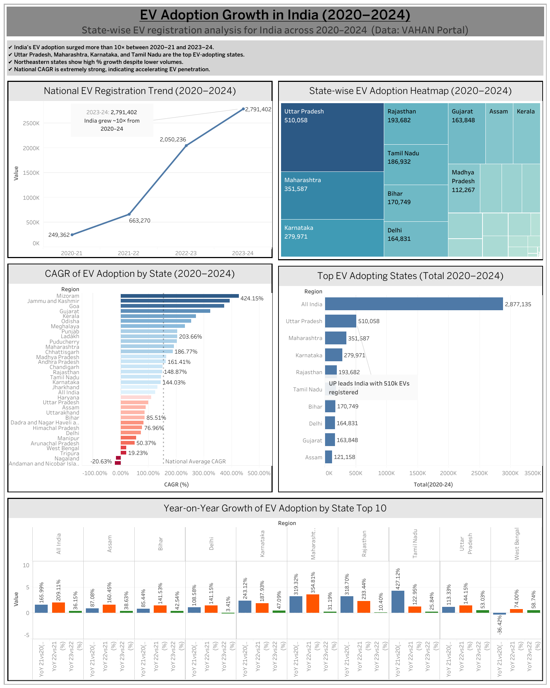

# 📘 EV Adoption Growth in India (2020–2024)
### *Data Analytics Project by Rishant Singh*

---

## 📝 Project Overview
This project analyzes the growth of Electric Vehicle (EV) adoption across India over the last five years.  
Using official EV registration data from the **VAHAN Portal**, I cleaned the dataset, calculated YoY growth, CAGR, and totals, and built an **interactive Tableau dashboard** to visualize national and state-wise EV trends.

This project helped me understand real data cleaning, growth analysis, and dashboard-building skills.

---

## 🖼️ Project Report

## 📄 Project Report (PDF)
[Download Stylish EV Report](EV_Portfolio_Report_Stylish.pdf)

## 📊 Tableau Dashboard
https://public.tableau.com/app/profile/rishant.singh/viz/ev_growth_rate_india/Dashboard1

---

## 📂 Files Included in This Repository
- **EV_cleaned_data.csv** — Final cleaned and transformed dataset  
- **dashboard.png** — Screenshot of the Tableau dashboard  
- **dashboard_link.txt** — Direct link to the Tableau dashboard  
- **README.md** — Description of the full project (this file)

---

## 🔍 Key Insights From the Data
- India’s EV registrations increased **10×** from 2020–21 to 2023–24  
- **Uttar Pradesh, Maharashtra, Karnataka, and Tamil Nadu** are the top EV-adopting states  
- Northeastern states show high **YoY % growth** because of small base  
- India shows a strong **CAGR**, indicating rapid EV adoption momentum  
- States differ widely in EV adoption depending on policies and population

---

## 🧹 What I Did in This Project

### ✔ Data Cleaning
- Removed unnecessary characters  
- Standardized state names  
- Organized dataset into clean columns  

### ✔ Feature Engineering
- Calculated **Year-on-Year (YoY) Growth %**  
- Calculated **CAGR (2020–2024)**  
- Added **Total EV Registrations** per state  
- Added **All India summary row**

### ✔ Visualization
Created a multi-view Tableau dashboard including:
- National EV growth trend  
- State-wise EV heatmap  
- CAGR ranking chart  
- YoY comparison chart  
- Top EV states chart  

---

## 🛠 Tools Used
- **Excel** — Data cleaning & calculations  
- **Tableau Public** — Dashboard creation  
- **Basic Math** — YoY %, CAGR, totals  

---

## 🎯 What I Learned
- How to prepare real datasets for analysis  
- How to calculate and interpret growth metrics  
- How to build clear and meaningful dashboards  
- How to communicate insights simply  

---

## 👤 About Me
**Rishant Singh**   
Focused on Excel, SQL & Tableau.

---

